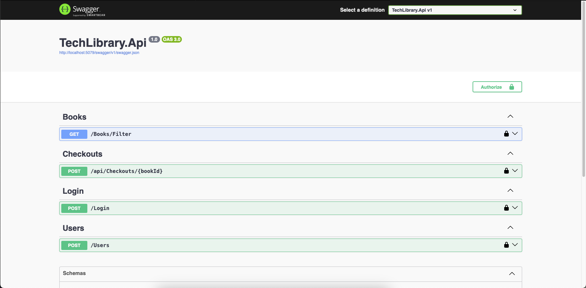

# TechLibrary

TechLibrary é um projeto multi-camadas construído com ASP.NET Core, seguindo os princípios da Clean Architecture. Ele implementa funcionalidades como registro de usuários e checkout de livros, utilizando Entity Framework Core com SQLite para persistência e FluentValidation para validações.

## Índice

- [Visão Geral](#visão-geral)
- [Funcionalidades](#funcionalidades)
- [Tecnologias Utilizadas](#tecnologias-utilizadas)
- [Estrutura do Projeto](#estrutura-do-projeto)
- [Configuração e Execução](#configuração-e-execução)
    - [Pré-requisitos](#pré-requisitos)
    - [Configuração do Banco de Dados](#configuração-do-banco-de-dados)
    - [Migrações e Atualizações do Schema](#migrações-e-atualizações-do-schema)
    - [Execução do Projeto](#execução-do-projeto)
- [Tratamento de Exceções e Filtros](#tratamento-de-exceções-e-filtros)
- [Injeção de Dependências](#injeção-de-dependências)
- [Autenticação e Segurança (JWT)](#autenticação-e-segurança-jwt)
- [Imagens do Projeto](#imagens-do-projeto)

## Visão Geral

O projeto TechLibrary é composto por diversas camadas:

- **TechLibrary.Api**: Responsável por expor os endpoints da API e lidar com as requisições HTTP.
- **TechLibrary.Application**: Contém os casos de uso (use cases), regras de negócio e serviços de aplicação, como o registro de usuário e o checkout de livros.
- **TechLibrary.Domain**: Define as entidades e regras de negócio, como a entidade de usuário e a entidade de livro.
- **TechLibrary.Communication**: Contém mapeamentos entre DTOs e entidades, bem como validações de requisições.
- **TechLibrary.Exceptions**: Define exceções personalizadas para tratar erros específicos.
- **TechLibrary.Infrastructure**: Implementa o acesso a dados usando o Entity Framework Core e mapeia as entidades para o SQLite.
- **TechLibrary.Persistence.Abstractions**: Define abstrações para a persistência de dados, permitindo desacoplamento entre aplicação e infraestrutura.

## Funcionalidades

- Registro de usuários através do endpoint `POST /users` (implementado em UsersController).
- Implementação do caso de uso para checkout de livros através do endpoint `POST /api/checkouts/{bookId}` (implementado em CheckoutsController).
- Validação de requisições utilizando FluentValidation (presente na camada de Application e verificada pelos validators, como em RegisterUserValidator).
- Tratamento centralizado de exceções com filtros personalizados (configurado na camada TechLibrary.Api, utilizando ExceptionFilter ou IExceptionFilter).
- Autenticação e autorização via JWT (configurada no Program.cs, com endpoints de Login via `POST /login` e proteção dos demais endpoints via JWT).
- Acesso ao HttpContext com IHttpContextAccessor para disponibilizar dados do usuário logado (utilizado em serviços como LoggedUserService).

## Tecnologias Utilizadas

- [.NET 8.0](https://dotnet.microsoft.com/download)
- ASP.NET Core
- Entity Framework Core (SQLite)
- FluentValidation
- JWT (JSON Web Tokens) para autenticação
- Swagger para documentação da API

## Estrutura do Projeto

A organização dos diretórios do projeto é a seguinte:
```
TechLibrary/ 
├── TechLibrary.Api/ # Camada de apresentação (API e controllers) 
├── TechLibrary.Application/ # Casos de uso, serviços e regras de negócio 
├── TechLibrary.Communication/ # Comunicação entre camadas (DTOs, mapeamentos, etc.)
├── TechLibrary.Domain/ # Definição de entidades, interfaces e abstrações
├── TechLibrary.Exceptions/ # Definição de exceções personalizadas
├── TechLibrary.Infrastructure/ # Acesso a dados (DbContext, migrations, etc.) 
└── TechLibrary.Persistence.Abstractions/ # Abstrações de persistência
```

## Configuração e Execução

### Pré-requisitos

- [.NET SDK 8.0](https://dotnet.microsoft.com/download)
- SQLite (não precisa ser instalado separadamente, pois o EF Core utiliza o pacote Microsoft.Data.Sqlite)

### Configuração do Banco de Dados

O projeto utiliza SQLite para persistência. Certifique-se de que a connection string esteja configurada corretamente.  
Exemplo de configuração em `appsettings.json` (localizado em TechLibrary.Api):

```json:TechLibrary.Api/appsettings.json
{
  "ConnectionStrings": {
    "DefaultConnection": "Data Source=TechLibrary.Infrastructure/Data/Database/TechLibraryDb.db"
  }
}
```

- Atenção: Se você já possui um banco de dados existente com as tabelas e dados preenchidos, ajuste o caminho da connection string para apontar para o arquivo correto e remova chamadas que criem ou migrem o schema automaticamente, se necessário.

- Migrações e Atualizações do Schema
Para criar e aplicar migrations (caso o schema do banco precise ser atualizado), execute os comandos a partir da raiz do projeto:
```
dotnet ef migrations add InitialMigration --project TechLibrary.Infrastructure --startup-project TechLibrary.Api
```
```
dotnet ef database update --project TechLibrary.Infrastructure --startup-project TechLibrary.Api
```

## Execução do Projeto
Para rodar a API, utilize o comando:
```
dotnet run --project TechLibrary.Api
```

## Tratamento de Exceções e Filtros
- Os filtros de exceção estão centralizados na camada TechLibrary.Api. Eles interceptam exceções não tratadas e retornam respostas apropriadas para o cliente, mantendo o código de negócio limpo. Filtros personalizados podem ser implementados derivando de ExceptionFilterAttribute ou IExceptionFilter.

## Autenticação e Segurança (JWT)
O projeto utiliza JWT para autenticação e proteção dos endpoints. A implementação inclui:

- Configuração da segurança JWT no Program.cs, onde é adicionado:
- A definição de um esquema de segurança via JWT no Swagger.
- A validação dos tokens JWT nos endpoints protegidos.
- Serviços de autenticação como DoLoginUseCase na camada de aplicação para emissão do token.
- No arquivo appsettings.json, configure as chaves e parâmetros (Key, Issuer, Audience) para a geração e validação dos tokens.


## Injeção de Dependências
O projeto faz uso do container de Injeção de Dependências do ASP.NET Core para gerenciar a criação dos serviços. Alguns pontos importantes:

- DbContext e Repositórios: Registrados na camada TechLibrary.Infrastructure.

- Casos de Uso e Serviços: Registrados na camada TechLibrary.Application (por exemplo, RegisterUserUsecase e RegisterBookCheckoutUseCase).

- Acesso ao HttpContext: Para acessar o contexto HTTP em serviços como LoggedUserService, foi utilizado o IHttpContextAccessor, que é registrado em Program.cs:
```
builder.Services.AddHttpContextAccessor();
```

## Imagens do Projeto
